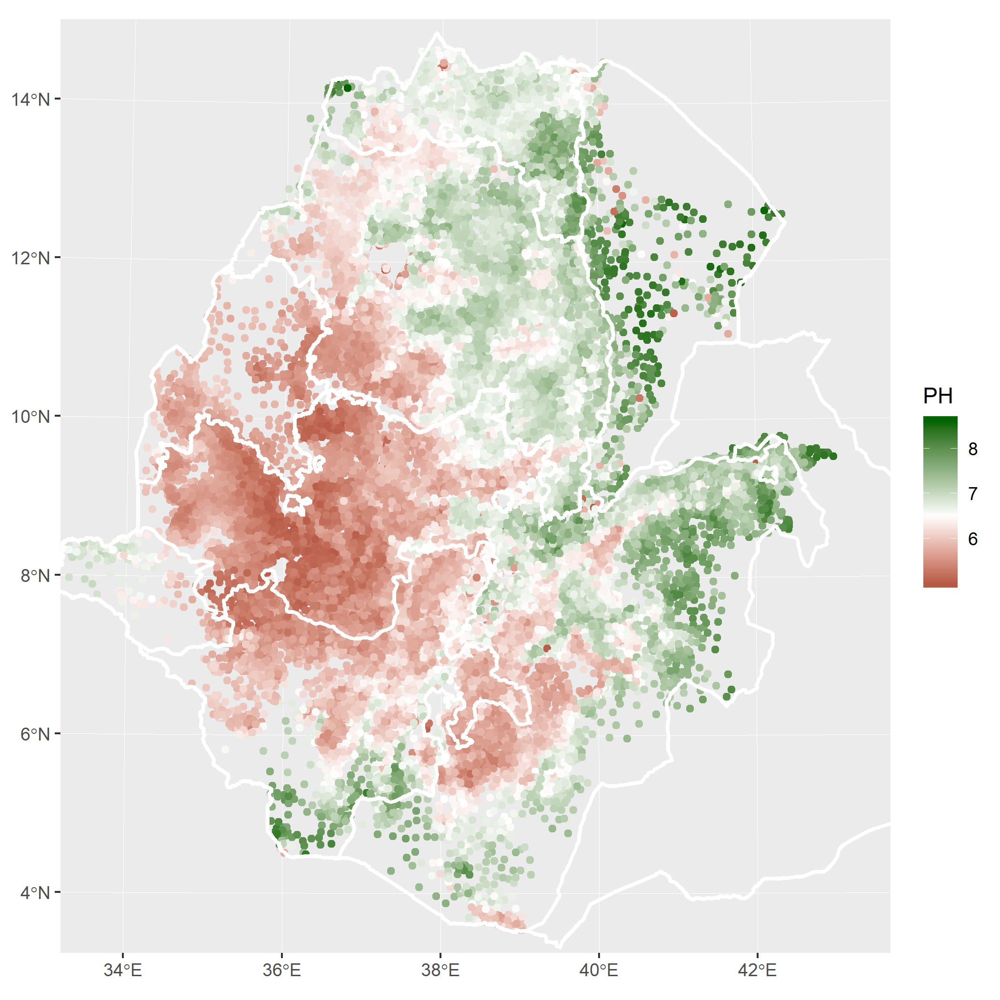

# Data Sources {#data}


```{r read in data & merge, message=FALSE, warning=FALSE, cache=T, include=FALSE}
EA_data = read.dta13('./Data/AGSS/Mike_transfer_raw_data_5_28_19.dta')   
EA_satellite = read.csv('./Data/Google_Earth_Engine/CWD_PPT_PDSI_by_EA.csv') #%>% select(-c('.geo'))
EA_satellite$EACODE = EA_satellite$EA_cd_m

# select relevant data, convert to long
EA_satellite = EA_satellite %>% select(matches("cwd|aet|pdsi|EACODE")) %>%   
                  gather(key='Year',value = 'Value',-EACODE) %>% arrange(EACODE) %>%
                  separate(Year, c('Variable',"Year"),sep='\\.')  %>% spread(Variable, Value) %>% 
                  mutate(Year = as.numeric(Year))

EA_join = inner_join(EA_data,EA_satellite)
```


```{r read windsorize and clean data, message=FALSE, warning=FALSE, include=FALSE, paged.print=FALSE,  cache=T}
 
EA_join = read.csv('./Data/EA_join_james_share.csv')
```


## Survey Data - Agricultural Sample Survey Data (2010-2016)
Survey for this report was obtained from Ethiopia's Central Statistical Agency's (CSA) Agricultural Sample Survey (AgSS). The AgSS is collected annually by the Ethiopian government. It is a large-scale survey tasked with measuring agricultural production in Ethiopia at the zonal level [^agss].  Each year the AgSS interviews approximately 45,000 farmers on a range of farm management questions covering some basic demographics of the household as well as a range of questions concerning planting, harvesting and selling at the plot level. Typically, about 20 farm households are randomly sampled from small local village-level areas of approximately 200 households (the sub-kebele level). From this sampling frame, a random selection of about 2,200 sub-kebeles are chosen as a representative sub-sample for zonal level agricultural production. Population weights are then applied to project agricultural production at the zonal level. For this study, we construct longitudinal data over the six crop seasons and are able to maintain 75% of all households over the 2010-2015 period at the sub-kebele level.

[^agss]: Beyond the nation, Ethiopia has four official levels of administrative areas. These include, in order of geographic size, regions, zones, woredas and kebeles.  There are approximately 12 regions, 88 zones, 690 woredas and 15,000 kebeles.  For our purposes, we use the sub-kebele, not recognized as a geographic region for administrative purposes, but commonly used for statistical sampling and are roughly based on population.  There are over 75,000 sub-kebeles in the country.

While this study collected data on the five principal Ethiopian field crops (teff, wheat, maize, barley, sorghum), we focus here on wheat, and barley because of their importance in Ethiopia's food system. The principal unit of analysis is the sub-kebele and all relevant CSA data is aggregated to this level. The survey data represents an amalgamation of all 20 households as a single representative farmer, we refer to as a "super-farmer." This was done for a variety of reasons including the fragmented plot farming system common in Ethiopia as well as CSA data collection methodology. More specifically, CSA data collection methodology relies on crop cuts to estimate productivity at the local level.  Depending on the actual number of farmers growing the specific crop, CSA collects up to five different individual farmer crop cuts, averages the yields, and projects this figure onto all plot areas for that crop in the sub-kebele.

For this study we utilized these crop measures of crop yields, measured in quintals per hectare (qq/ha), the percentage of plots applied with 'improved seeds', the percentage of plots that have access to irrigation, the percentage of plots actively receiving extension agent support, the intensity of chemical fertilizer use (kg/ha), and the percentage crops reported as damaged by the farmer. Damages include a number of factors including weather, drought, and pests. 

## Edaphic Properties
Data on edaphic (soil) properties was collected from The Ethiopian Soil Information System (EthioSIS). EthioSIS is charged with gathering soil samples from all major growing regions to help provide detailed information on soil fertility, and to provide fertilizer recommendations. For this study we access EthioSIS measures of soil pH to be used as our variable of interest, as well as measures of cation exchange capacity, soil organic content, and sand content. Cation exchange capacity is a measure of a soils ability to hold and supply nutrients to plants and is affected by soil pH. 

A map summarizing soil pH levels across the county can be seen below in Figure `r paste(Figure_number)`

*Figure* `r paste(Figure_number)`*: Map of Ethiopia's soil pH balance*`r  Figure_number =Figure_number+1 `

```{r Plot soil acidity, eval=FALSE, message=FALSE, warning=FALSE, cache=TRUE, include=FALSE, paged.print=FALSE,fig.width=6}
# country = read_sf('./Data/AdminBoundaries/ETH_adm1.shp')
# country = as_Spatial(st_transform(country,32637))
# proj4string(country) = '+init=epsg:32637 +proj=utm +zone=37 +datum=WGS84 +units=m +no_defs +ellps=WGS84 +towgs84=0,0,0'
# 
# all_EAs = read_sf( './Data/EA Shapefile/AGSS_EnumerationAreas_WGS_codes.geojson' )
# all_EAs$EACODE = all_EAs$EA_code_merge
# all_EAs_PH = inner_join(all_EAs %>% select(c(EACODE,geometry,x_coord,y_coord)), EA_data %>% filter(Year == 2010 ) %>% select(EACODE,PH) )
# 
# sp_all_EAs_PH = as.data.frame(all_EAs_PH %>% select(-c(geometry)))
# coordinates(sp_all_EAs_PH)<- ~x_coord+y_coord
# proj4string(sp_all_EAs_PH)<-  CRS("+init=epsg:32637")

# krig
# ptsreg = spsample((country), 4000, type = "regular")   # Define the ouput grid - 4000 points in polygons extent
# Krig = autoKrige(PH~1,sp_all_EAs_PH, new_data = ptsreg)$krige_output
# interp_data  = as.data.frame(Krig)
# save(interp_data,file='../Data/R_images/interp_data.rda')
load('./Data/R_images/interp_data.rda')
# plot
a = ggplot() + geom_tile(data=interp_data, aes(x=x1, y=x2,fill=var1.pred))+scale_fill_gradient2( low = 'red',mid='white', high = 'blue',midpoint = 6.5,'pH' )+xlab('')+ylab('')

a+geom_sf(data=st_as_sf(country),aes(),color='white',size=1,fill=NA)+coord_sf(xlim=c(-90657.53,966145.),ylim=c(418602.3,1607672.7)) 
```

```{r ethioSIS ph map, eval=FALSE, include=FALSE,fig.width=6}
ethsis = read.dta13('./Data/EthioSIS/EthioSIS_EA_Cleaned_April_4_2019.dta')
ethsis = ethsis %>% filter(!is.na(x_coord) & !is.na(y_coord))
ethsis_pnt = st_as_sf(x = ethsis, 
                        coords = c("x_coord", "y_coord"),
                        crs = "+proj=utm +zone=37 +datum=WGS84 +units=m +no_defs")

b=ggplot() + geom_sf(data=ethsis_pnt%>%sample_frac(size=0.7)%>%filter(PH>5),aes(color=PH))+scale_colour_gradient2(low='darkred',mid='white',high='darkgreen',midpoint = 6.5)
b+geom_sf(data=st_as_sf(country),aes(),color='white',size=1,fill=NA)+coord_sf(xlim=c(-90657.53,966145.),ylim=c(418602.3,1607672.7)) 

```




## Remotely Sensed Variables 
We obtain climatic variables from the University of Idaho's TerraClimate data. TerraClimate provides monthly estimates of surface water balance at 1/24th of a degree (~4km) spatial resolution [^terra]. Measures of water balance are particularly relevant to this study because it provides an estimate of water available to plants by looking at the balance between water gained from precipitation and runoff, and that lost to evaporative demand. The amount of water moving through a system is driven by two forces: (1) the supply of water through rainfall and (2) the demand for water, driven primarily by energy from the sun, which allows for evaporation and movement of water through plants but is also affected by wind, vapor pressure, and soil properties. Here we use a measure called the Palmer Drought Severity Index which is derived as a measure of the balance between available water due precipitation and potential evapotranspiration [@abatzoglou2014tracking].

[^terra]: http://www.climatologylab.org/terraclimate.html
 
Elevation data is obtained from NASA's Shuttle Radar Topography Mission (SRTM) at 90 meter resolution [^SRTM].

[^SRTM]: https://www.usgs.gov/centers/eros/science/usgs-eros-archive-digital-elevation-shuttle-radar-topography-mission-srtm-1-arc?qt-science_center_objects=0#qt-science_center_objects

<!-- To proxy the effects of rainshadows we simulate orthographic uplift and the resulting rainshadow by simulating the movement of air on an east-west trajectory and comparing the current elevation to the maximum observed elevation. A pixel at 1000m to the west of a mountain with a maximum elevation 1500m would have a rainshadow index value of 500. To avoid rainshadows extending far to west of a mountain the 'observed maximum' is multiplied by 0.999 each pixel to the west of the maximum. This results in rainshadows that largely decay between 50-75km. Although this is certainly an oversimplification of a complex process, we believe it provides a reasonable representation of rainshadow effects given the lack of any better data product.   -->

 

### Variable Definitions

In our multivariate model we control for a variety of independent variables. These are outlined in the table below:

*Table* `r paste(Table_number)`*: Variable Definitions and Sources*`r variables =Table_number; Table_number =Table_number+1 `

```{r variable definitions,  message=FALSE, warning=FALSE, include=T}

variables = data.frame(Name = c('PH','CEC', 
                                'SOC','SND',
                                #'G_mx','PPT_A_mn',
                                'elevation','pdsi',
                                'yield',
                                'EXT_AREA_p','IMSEED_p','IRG_AREA_p',
                                'DAMAGE_AREA_p','FERT_PER_AREA',
                                'PSNP_Dum','AGP_Dum'
                                ),
                       
                       Definition=c('Mean pH','Cation exchange capacity', 
                                    'Soil organic content','sand content',
                                    #'Maximum observed greenness (NDVI)',
                                    #'Mean annual precipitation (mm)',
                                    'Elevation (meters)','Palmer drought severity index ()',
                                    'Observed crop yeild in (qq/ha)',
                                    'Area advised by extension agents (%)',
                                    'Area applied with improved seeds (%)','Area irrigated (%)',
                                    'Area reported as damaged by farmer (%)', 
                                    'Chemical fertilizer intensity (kg/ha)',
                                    'PSNP_Dum','AGP_Dum'
                                    ),
                       
                       Source=c('EthioSIS','EthioSIS', 
                                    'EthioSIS','EthioSIS',
                                    'Remotely Sensed',
                                    'Remotely Sensed',#'Remotely Sensed','Remotely Sensed',
                                    'AgSS',
                                    'AgSS',
                                    'AgSS','AgSS',
                                    'AgSS', 
                                    'AgSS',
                                    'Other','Other'
                                    ))

flextable(variables) %>%  merge_v( j = 3 ) %>% border_inner_h(border = std_border ,part='body') %>% autofit() 

```
 
 
 