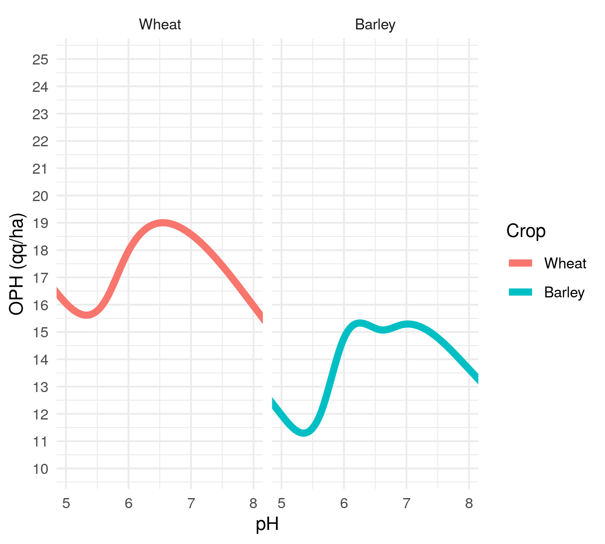
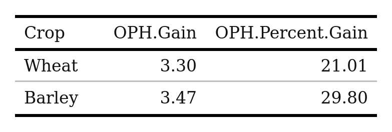
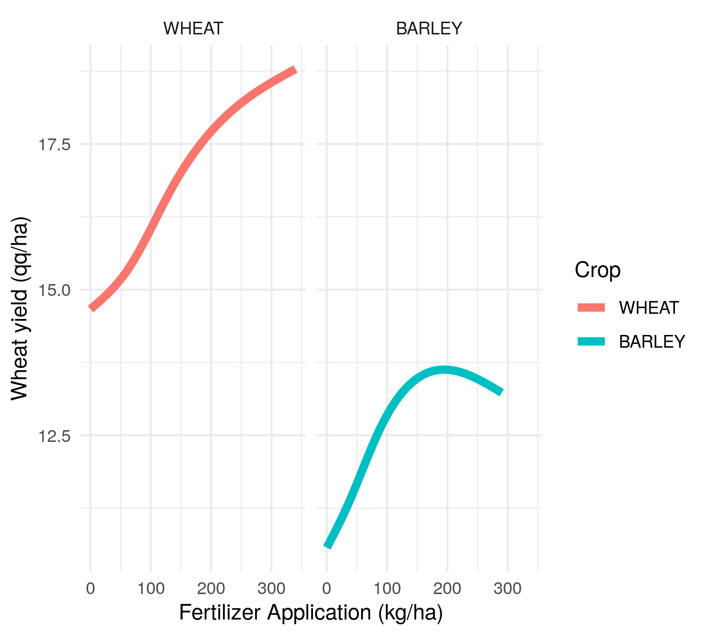
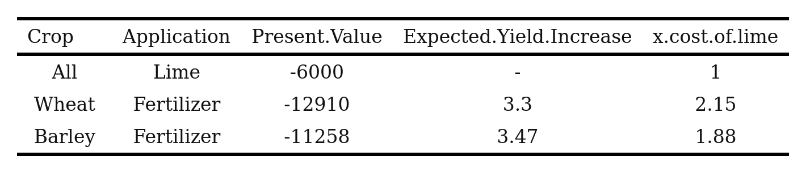
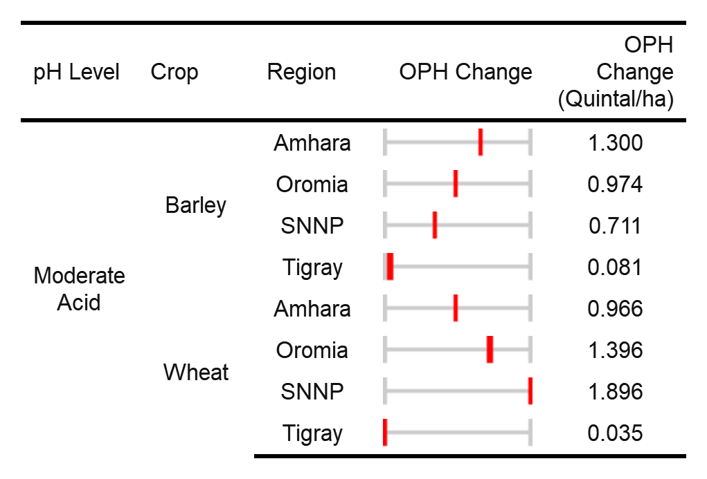
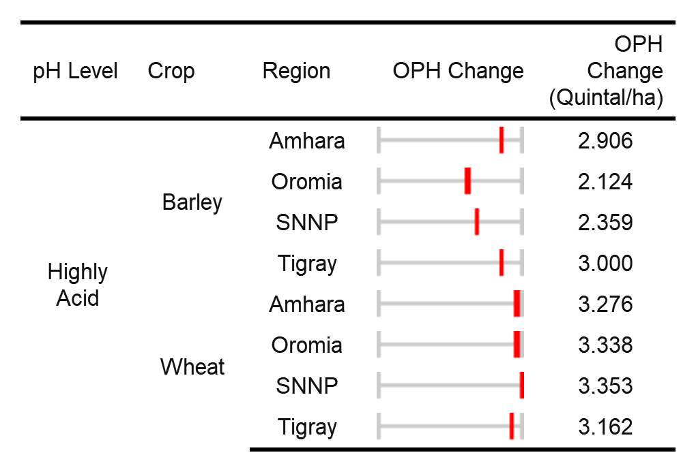
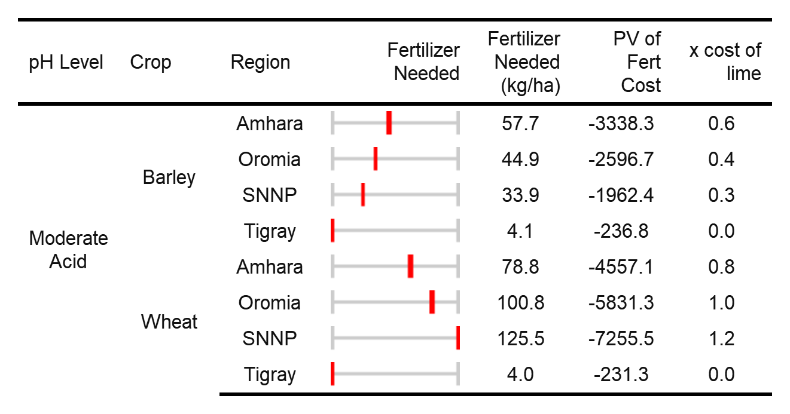
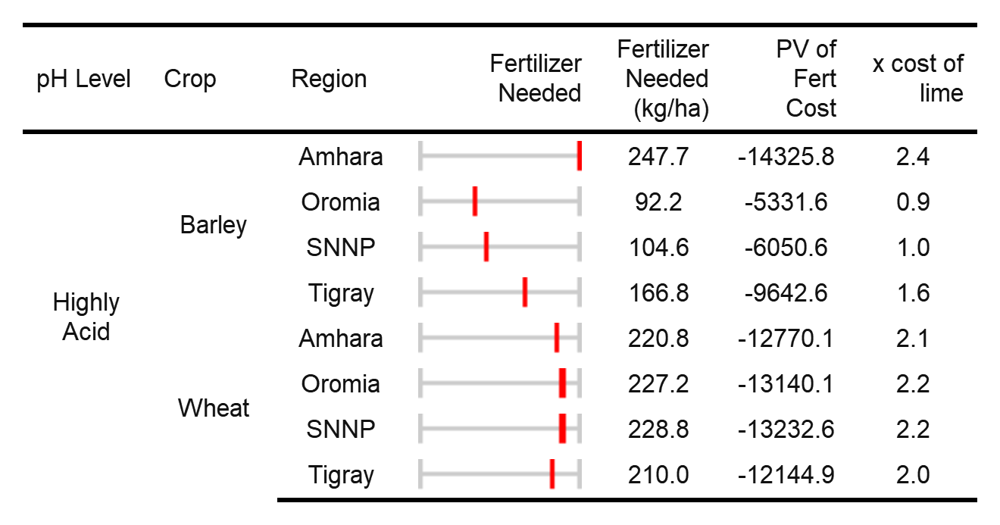

# Findings {#findings}

 
## National Estimates 
 
To isolate the marginal effect of pH on yields we can hold all other variables at their mean (fixed effects variables are set to a specific year and zone, here 2010 and zone number 302) while letting the variable of interest vary. For more information on how these estimates were made refer to [Methods](#methods). 

*Figure* `r paste(Figure_number)`*: Trace of marginal response of wheat yield to changes in pH*`r ph_oph_trace =Figure_number; Figure_number =Figure_number+1 `




Looking at Figure `r ph_oph_trace` above we can see that moving pH from 5.5 to 6.5 corresponds to a significant increase in yields for wheat while holding fertilizer utilization, rainfall, and other variables of interest at their means. The gain obtained from moving soil pH from 5.5 to 6.5 for all crops is presented in Table `r paste(Table_number)` below. **These curves will be used in the next section to calculate the economic net benefit of application of lime (to increase pH) to soils.** <br>

 
*Table* `r paste(Table_number)`*: Output per hectare gains from changing pH from 5.5 to 6.5*`r Table_ph_OPH = Table_number; Table_number =Table_number+1 ` 




We can also trace the impact of increasing fertilization rates for wheat and barley in Figure `r paste(Figure_number)` below. <br>
 
*Figure* `r paste(Figure_number)`*: Marginal response of wheat yield to changes in fertilizer application holding pH at 5.5*`r fert_oph_trace =Figure_number; Figure_number =Figure_number+1 `



Looking at Figure `r fert_oph_trace` for wheat, we can see that adding an additional 100 kg per ha of fertilizer corresponds to a substantial increase in yields while holding pH at 5.5, and rainfall, and other variables of interest at their means. This curve can then be used to calculate the economic net benefit of application of fertilizer.


As such we can estimate the present value of applications of lime and fertilizer required to obtain the same qq/ha increase in wheat yields estimated above.


*Table* `r paste(Table_number)`*: Wheat: Present value of lime and fertilizer applications required for equivalent yield increases *`r Table_PV =Table_number; Table_number =Table_number+1 `



```{r include=FALSE}

PV_dataframe =readRDS('./Images/PV_dataframe.rds')
PV_dataframe
```


From table `r Table_PV` we can see that, that the present cost of fertilizer use for wheat is `r as.character(PV_dataframe['Wheat','x.cost.of.lime'])` times that of a single lime application. Meanwhile the cost of a comparable fertilizer application for barley is `r as.character(PV_dataframe['Barley','x.cost.of.lime'])` times as high as lime. As such lime can provide substantial savings to both small and large farms across a variety of crops. It should be noted however that there are additional benefits to treating acidic soils with lime instead of compensating with nitrogen. Benefits of liming not easily captured in this study include:

* Reductions in additional acidification through fertilizer application
* Supplies Ca and Mg to plants
* Reduced toxicity to plants of Al and Mn
* More rapid mineralization of organic N and greater availability of P
* Stimulation of microbial activity
* Greater availability of micro-nutrients


## Regional Estimates {#region}

The impacts of these applications vary significantly by both actual pH level and location. There is a great deal of variability even between regions in terms of policy interventions, but also in terms of the actual pH levels.  Therefore the benefits of mitigating "moderately" acidic soils is far more beneficial in Amhara than in Tigray. 

To examine some of this variability we break down the expected increase in yields (OPH) from raising the pH of each sub-kebele to 6.5 by crop and region below:

 
*Table* `r paste(Table_number)`*: Median impact of increasing pH from actual to 6.5 in qq/ha for moderately acidic soils*`r Table_oph_mod_acid =Table_number; Table_number =Table_number+1 `




As we can see there is a great deal of variability between crops, with high gains in output for wheat and barley (Table `r Table_oph_mod_acid`). These differences are largely driven by difference in each plant's response to pH level. It is also driven by the planting location its respective soil properties, like aluminum concentrations that mitigate or aggravate the impact of a low pH balance. 

Within a given crop, for instance wheat, variability in yield response can largely be explained by the region's distance from a median pH of 6.5. As explained earlier, the pH in Amhara, SNNP, and Oromia are at the lower end of "moderately" acidic, therefore gains can be substantial. Meanwhile Tigray's "moderately" acidic soils are extremely close to a pH of 6.5, therefore raising the pH provides less benefit.

*Table* `r paste(Table_number)`*: Median impact of increasing pH from actual to 6.5 in qq/ha for highly acidic soils*`r Table_oph_acidic =Table_number; Table_number =Table_number+1 `




Looking at Table `r paste(Table_oph_acidic)` above for highly acidic soils, we see for both barley and wheat substantial yield gains are obtainable by properly adjusting the pH balance. This uniform yield response across regions can be explained by the overriding influence of a pH significantly below certain levels. 

Following the approach shown in Table `r Table_number` we can calculated the present value of the amount of fertilizer needed to match the yield gains obtained by increasing the pH to 6.5. Again we break this down by acidity class, region and crop. 

*Table* `r paste(Table_number)`*: Median fertilizer requirements to match lime application for acidic soils*`r Table_PV_mild =Table_number; Table_number =Table_number+1 `




Table `r paste(Table_PV_mild)` demonstrates for mildly acidic soils - from a purely economic standpoint - that the application of fertilizer on average is less costly than the application of lime. In the case of barley, lime may prove more expensive in all regions, on average.  In the case of wheat, there may be some slight advantage to lime application in SNNP, but not in other regions. Keep in mind however there are a number of other non-financial benefits to soil remediation and proper pH balance. 

*Table* `r paste(Table_number)`*: Median fertilizer requirements to match lime application for highly acidic soils*`r Table_PV_region_high_acid =Table_number; Table_number =Table_number+1 `



```{r include=FALSE}
 h_acidic_oph = readRDS('./Images/h_acidic_oph.rds')

PV_lime = pv(r=discount_rate, n=1, fv = 0, pmt = total_lime_cost, type = 1)

```


For highly acidic soils (Table `r Table_PV_region_high_acid`), the economic gains of lime applications become clear, especially for wheat in all regions. Across all regions the economic benefit of lime application for wheat in highly acidic soils is  `r round(h_acidic_oph %>% filter(Crop=='Wheat') %>% select(PV.Fert.needed.match.6.5) %>% unlist()%>% mean(rm.na=T) / PV_lime,2)` times that of fertilizer applications.  Barley grown in Amhara and Tigray also see a substantial benefit from the application of lime. On average these two regions the economic benefit is `r round(h_acidic_oph %>% filter(Crop=='Barley')%>% filter(Region=='Amhara'|Region=='Tigray') %>% select(PV.Fert.needed.match.6.5) %>% unlist()%>% mean(rm.na=T) / PV_lime,2)` times that of fertilizer applications. 

*The benefits of lime application however extend well beyond simple yield gains, and are worth repeating.* The benefits of lime application include: increased Ca Mg and P supply, reduced mineral toxicity, stimulation of microbial activity, avoiding induced acidification through fertilizer application, and more efficient uptake of N and availability, amongst others. 


## Local Estimates {#local}

We can also look at the spatial distribution of these gains in productivity from lime application. Below we can see the impact of lime application to increase pH to a minimum of 6.5 for both barley and wheat. 


```{r echo=FALSE}
ph_join_wheat = readRDS("./Images/map_ophgain_wheat.rds")
names(ph_join_wheat) = dplyr::recode(names(ph_join_wheat),lm_pred_6_5_less_actual='Wheat Change in Yield (qq/ha)')

tmap_mode("view")

facets = c("Wheat Change in Yield (qq/ha)" )
tm_shape(ph_join_wheat) +  tm_dots( facets)
```


<br>
As expected the benefits of lime application follow patterns of soil pH but also reflect differences in growing conditions between both barley and wheat

```{r echo=FALSE}
library(dplyr)
ph_join_barley = readRDS("./Images/map_ophgain_barley.rds")

names(ph_join_barley) = dplyr::recode(names(ph_join_barley),lm_pred_6_5_less_actual='Barley Change in Yield (qq/ha)')


tmap_mode("view")
facets = c("Barley Change in Yield (qq/ha)" )
tm_shape(ph_join_barley) +  tm_dots( facets) 
```

***
A tutorial on making webmaps in R's BookDown can be found here [link](https://bookdown.org/robinlovelace/geocompr/adv-map.html#interactive-maps)
